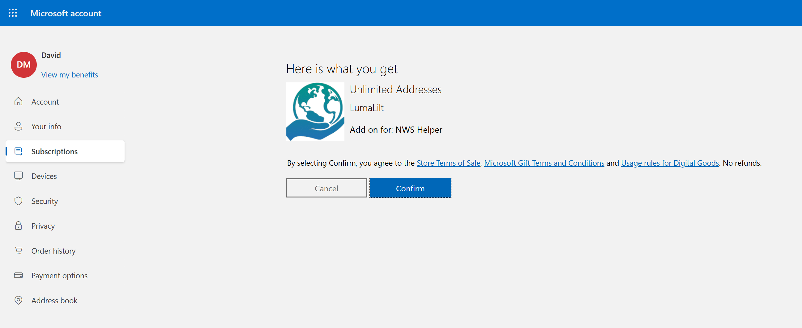
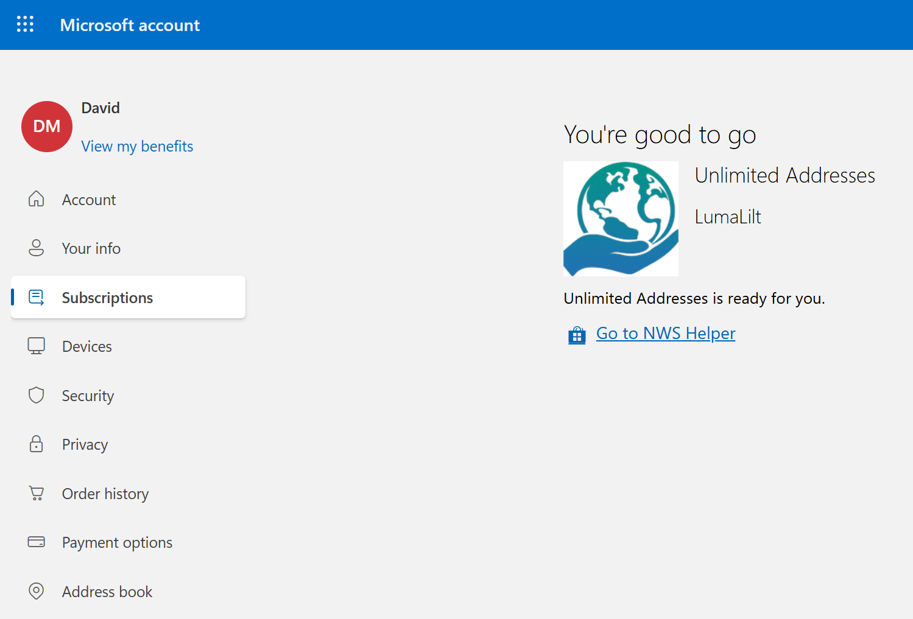
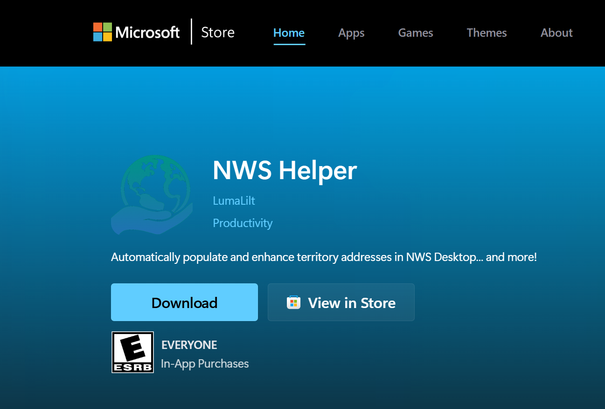

# Redeem a Windows Store Promo Code

Use your promo code redemption link to claim the NWS Helper Microsoft Store add-on or item, then install NWS Helper from the Store listing if not already installed.

## Redemption Flow

### 1. Open the promo code redemption link

If Microsoft asks you to sign in first, sign in with the Microsoft account you want to use with Microsoft Store on your Windows device.

What you should see:
The redemption flow may open in your Microsoft account page before taking you to the add-on or item confirmation screen.

### 2. Confirm the redemption

Review the redemption page and select **Confirm**.

What you should see:
The page shows the add-on name, the publisher **LumaLilt**, and the text **Add on for: NWS Helper** with **Cancel** and **Confirm** buttons.

### 3. Finish the claim

After redemption succeeds, select **Go to NWS Helper**.

What you should see:
The success page says **You're good to go** and confirms that **<The item name> is ready for you**.

### 4. Install NWS Helper

On the NWS Helper Store page, install the app using whichever option is available for your device.

What you should see:
The Microsoft Store web page for **NWS Helper** shows a **Download** button and a **View in Store** button.

Use this page as follows:

1. If NWS Helper is not installed yet, select **Download** to install from the web page when that option is available.
2. If you prefer the Microsoft Store app, or if the web page directs you there, select **View in Store** or **Open in Store** and complete the install in Microsoft Store.
3. If NWS Helper is already installed, open the app after redemption so it can use the redeemed Store entitlement.

## Quick Notes

- Redeem the promo code with the same Microsoft account you plan to use for Microsoft Store on the PC where you will run NWS Helper.
- The promo code claims an add-on or item for **NWS Helper**, so the add-on or item should be redeemed before first use of the app or the app should be restarted after claiming it.
- If the final page opens the Store listing in your browser, you can still switch to the Microsoft Store app by using **View in Store** or **Open in Store**.